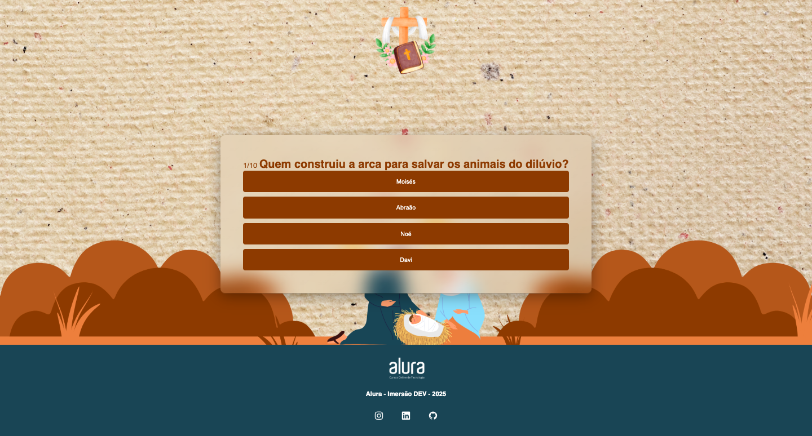

# 📖 Bíblia Quiz 🙏🏻🎮

Um quiz interativo e divertido sobre a Bíblia, criado com HTML, CSS e JavaScript!  
Desenvolvido com muito carinho durante a **Imersão Dev - Alura 2025** 💻

## 📸 Preview

Coloque aqui uma imagem do seu projeto (print da tela):

---

## 🎯 Objetivo

O objetivo do Bíblia Quiz é ensinar e entreter ao mesmo tempo!  
Com perguntas simples e diretas, a pessoa pode testar seus conhecimentos sobre histórias e personagens bíblicos de forma leve e divertida ✝️💬

---

## 🛠️ Tecnologias utilizadas

- HTML5
- CSS3
- JavaScript
- Bootstrap Icons

---

## ✅ Funcionalidades

- Exibição dinâmica das perguntas e respostas
- Contador de progresso da quiz 📊
- Resultado final com pontuação 🎉
- Layout responsivo para diferentes telas 📱💻

---

## 💻 Projeto criado por

Desenvolvido por [Esther Nascimento](https://github.com/esthernascimento) 💚👩🏻‍💻👽
Durante a **Imersão Dev da Alura - Edição 2025**

---

🔗 Acesse o Projeto
Você pode conferir o projeto funcionando aqui:
👉 Blibia Quiz - Clique para jogar!
(https://esthernascimento.github.io/quiz-biblico/)

---

## 📲 Contato

- [Instagram](https://www.instagram.com/esthernascimentooficial) 
- [LinkedIn](https://www.linkedin.com/in/esthernascimentooficial)  
- [GitHub](https://github.com/esthernascimento) 

---

> “Ensina a criança no caminho em que deve andar, e ainda quando for velho não se desviará dele.”  
> — Provérbios 22:6 ✨

